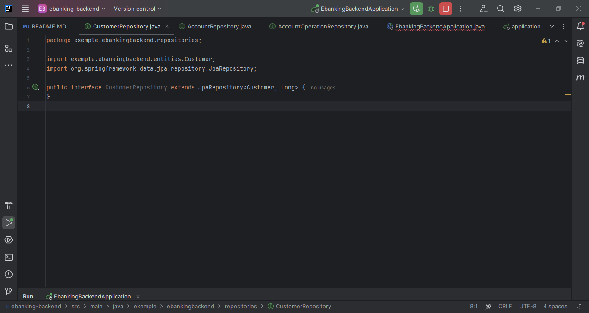
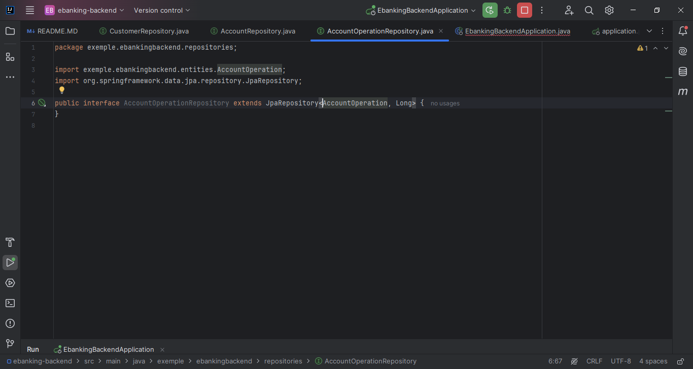
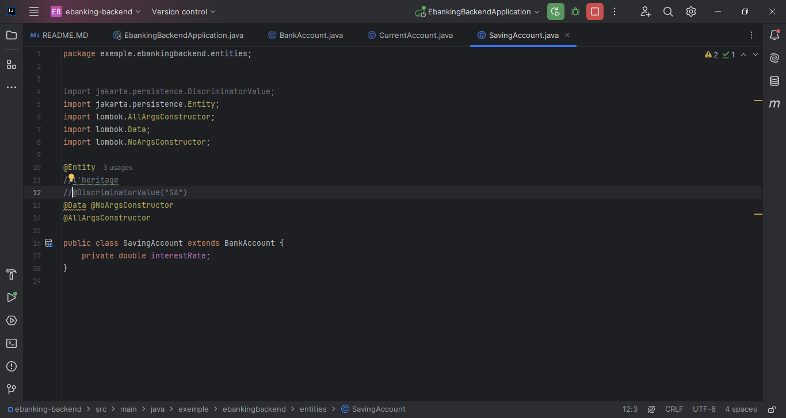
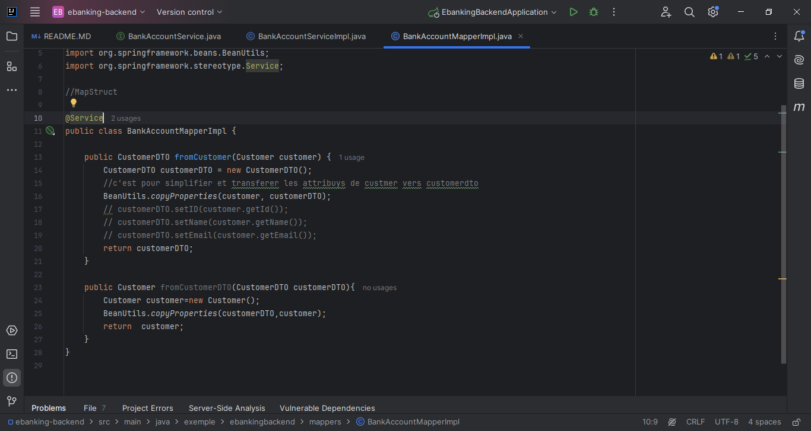

<h1>Compte Rendu</h1>
<h4>L'application web rendu html coté client permet de gerer les comptes et les clients de la banque et
gerer aussi les operations sur les comptes (versement, retraits, virements)</h4>
<h4>On cree des packages "entities, web, repositories, services, enums et mappers</h4>
<h4>Dans "entities" on ajoute :</h4>
<h4>La classe "Customer"</h4>

<h4>La classe "BankAccount"</h4>

<h4>Dans ces deux classes on fait le mapping objet relationnel par exemple @ManyToOne 
càd plusieurs compte pour un client</h4>
<h4>Dans la classe "BankAccount" on ajoute deux annotations @Inheritance(strategy = InheritanceType.SINGLE_TABLE)
c'est pour l'heritage de type single table càd  cree une seule table pour toutes hierarchie on a tous les attributs 
et on ajoute un autre colonne "Type" et aussi @DiscriminatorColumn(name = "TYPE", length = 4) pour donne à
la colonne un nom</h4>
<h4>La classe "AccountOperation"</h4>

<h4>La classe "CurrentAccount"</h4>

<h4>La classe "SavingAccount"</h4>

<h2>On a besoin de deux enumerations donc on ajoute dans package "enums" :</h2>
<h4>Enum "AccountStatus"</h4>

<h4>Enum "OperationType"</h4>

<h4>On va tester l'application</h4>

<h4>On ajoute dans le package "repositories" trois interfaces :</h4>
<h4>"CustomerRepository"</h4>

<h4>AccountRepository"</h4>

<h4>"AccountOperationRepository"</h4>

<h4>Pour tester on insere des clients  et des comptes dans "EbakingBackendApplication"</h4>

<h4>Dans browser on mets localhost</h4>

<h4>Pour specifier comment les valeurs d'une enum doivent etre stockées dans BD on ajoute l'annotation @Enumareted()</h4>

<h4>Dans "EbakingBackendApplication" on ajoute des opérations </h4>

<h4>On run l'application</h4>

<h4>Maintenant on chagne la strategie d'heritage en table per class</h4>

<h4>On run l'applicatio et on remarque que la table bankaccount ne cree pas et il y'a currentaccount et savingaccount qui 
sont crées (les dérivés de la classe bankaccount)</h4>

<h4>On bascule sur la strategie joined table </h4>

<h4>On remarque que tous les tables vont etre cree et dans la table bankaccount on trouve seulement leurs attribut</h4>

<h4>On retourne au strategie single table </h4>
<h4>On bascule maintenant à mysql on ajoutant la dependance </h4>

<h4>Dans "application.properties"</h4>

<h4>On veut consulter les comptes </h4>
<h4>Dans la classe "BankAccount" on ajoute à @OneToMany fetch = fetchtype.eager pour afficher toutes les opérations au contraire 
au lazy qui charge seulement les attributs  </h4>

<h4>Dans le package "service" on ajoute une interface "BankAccountService"</h4>

<h4>On ajoute un attribut description dans la calsse "AccountOperation"</h4>
<h4>On ajoute une classe qui implemente l'interface "BankAccountService"</h4>

<h4>Pour faire log on ajoute un attribut logger ou on mets l'annotation de lombok</h4>
<h4>on ajoute un autre package "exceptions"</h4>
<h4>Dans laquel on a les classes</h4>

<h4>Exception non survié càd on a pas besoin de throws à coté de la methode </h4>
<h4>on ajoute autre methode pour specifier si le compte courant ou non dans service</h4>
<h4>O rencontre deux exceptions , quand je implemente une operation metier</h4>
<h4>On fait un test de couche metier </h4>
<h4>On cree une methode qui va retourner une liste de comptes dans "service"</h4>

<h4>On ajoute dans package "web" une classe </h4>

<h4>lorsqu'on affiche la liste des customer on trouve qu'il y a une dependance cyclique pour 
les éviter on ajoute  @JsonProperty() dans la classe customer et on fait run </h4>

<h4>sans dtos on utilise les entitiés dans toutes les couches repos, service et rest api ca donne un probleme 
par exemple lorsqu'on retourne un client on retourne toutes ces attributs donc on la solution c'est utiliser DTOS 
par exemple on a la classe customer qui donne à repos on cree une autre classe dtos qui contient les attributs necessaire 
qui m'on interesse et Map permet de transferer par exemple un dtos vers entites </h4>
<h4>Dans package "Dtos" on ajoute une classe "customerDTO" </h4>

<h4>Dans le package "mappers" on ajoute une classe "BankAccountMapperImpl"</h4>

<h4>Dans service on change customer par customerDto</h4>
<h4>On ajoute une methode à "CustomerRestController"</h4>

<h4>et dans "service"</h4>

<h4>Pour ajouter un customer "web"</h4>

<h4>Dans "service" on change la methode save</h4>
<h4>On test dans postman</h4>

<h4>Dans "web" on ajoute update et delete</h4>

<h4>Dans "service"</h4>

<h4>On ajoute le dependance de springdoc openapi ui </h4>

